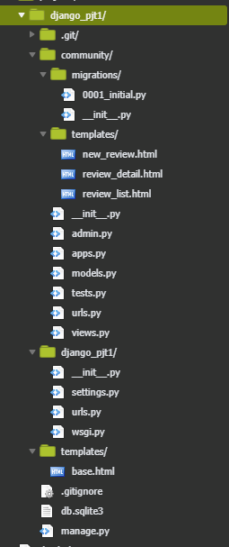

# 01. 프로젝트 구조

- 명세와 같이 디렉토리를 구성하였습니다.
- 

# 02. Model

- ```python
  from django.db import models
  
  # Create your models here.
  class Review(models.Model):
      title = models.CharField(max_length=100)
      content = models.TextField()
      rank = models.IntegerField()
      created_at = models.DateTimeField(auto_now_add=True)
      updated_at = models.DateTimeField(auto_now=True)
  
  ```

  

# 03 Admin

- easy peasy

# 04 URL

- 명세대로 path 추가

- ```python
  from django.urls import path
  from . import views
  
  urlpatterns = [
      path('',views.review_list),
      path('new_review/', views.new_review),
      path('create_review/', views.create_review),
      path('review_detail/<review_pk>/',views.review_detail),
      ]
  ```

- review_pk path 추가를 했지만 variable routing이 실행이 되지 않아 어려웠습니다.  import redirect를 추가 안했었습니다.

# 05 View & Template

- template

  ```python
  TEMPLATES = [
      {
          'BACKEND': 'django.template.backends.django.DjangoTemplates',
          'DIRS': [os.path.join(BASE_DIR, 'templates')],
          'APP_DIRS': True,
          'OPTIONS': {
              'context_processors': [
                  'django.template.context_processors.debug',
                  'django.template.context_processors.request',
                  'django.contrib.auth.context_processors.auth',
                  'django.contrib.messages.context_processors.messages',
              ],
          },
      },
  ]
  
  ```

  dir 추가하여 프로젝트 template이 아닌 곳에서도 열수있게!! 

- review_list.html

  ```html
  
  
  
  <h2>게시글 모음</h2>
  <ul>
      
      <li><h3>리뷰의 제목 : <a href="/community/review_detail/{{ review.pk }}">{{ review.title }}</a></h3></li>
      <li><h3>리뷰의 내용 : {{ review.content }}</h3></li>
      <li><h3>리뷰의 평점 : {{ review.rank }}</h3></li>
      <li><h3>리뷰가 최초 작성된 시간 : {{ review.created_at }}</h3></li>
      
  </ul>
  
  ```

  - `` <a href="/community/review_detail/{{ review.pk }}"> `` 이부분 코드를 짜는 데 어려웠습니다. ``{{ }}`` 이게아니라 명세대로 ``<>``  라 생각했었습니다.. 하지만 아니었다!

- new_review.html

  ```html
  
  
  
  <h2>글작성</h2>
  <form action="/community/create_review/">
      리뷰의 제목 : <input type="text" name="title"></br>
      리뷰의 내용 : <textarea type="text" name="content"></textarea></br>
      리뷰의 평점 : <input type="number" name="rank"></br>
      <input type="submit" value="게시글 작성"></br>
      <hr>
      <a href="/community/">BACK</a>
  </form>
  
  
  ```

- create_review.html 은 작성할 필요가 없다!

- views.py

  ```python
  from django.shortcuts import render,redirect
  from .models import Review
  # Create your views here. project
  def review_list(request):
      reviews= Review.objects.all()
      context = {
          'reviews':reviews,
  
  
      }
      return render(request, 'review_list.html',context)
  
  def new_review(request): #데이터를 작성할 페이지  #new
      return render(request, 'new_review.html')
  
  def create_review(request): #데이터를 DB에 저장하는 로직  #create
      title = request.GET.get('title')
      content = request.GET.get('content')
      rank = request.GET.get('rank')
      #create
      article = Review(title=title, content=content, rank=rank)
      article.save()
      return redirect(f'/review_detail/{review.pk}/')
  
  def review_detail(request,review_pk):
  
      review= Review.objects.get(id=review_pk)
      context = {
  
          'review':review,
      }
      return render(request, 'review_detail.html',context)
  ```

  - ``review_detail`` routing variable 개념을 처음에 몰라서 어려웠지만 잘해결..!  

  - **의문: ``create_review`` 에서 review.pk 로 return 했는데 ``review_detail`` 에서 review_pk 로 잘 받는건,, 음 함수니까,, 변수명이 아무렇게 해도 ? 상관없어서 겠죠 ? 그리고 .. revirw_pk값을 어떻게 저렇게 잘받아오나요 ? 어디서 받아올까요 .. **

    

