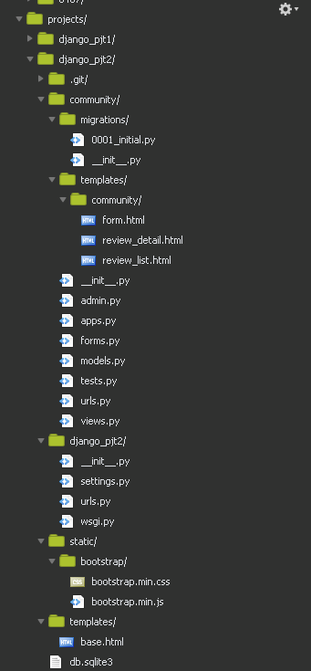

## 1. 프로젝트, 앱생성

## 2. 디렉토리 구성



## 3. model 작성

```python
from django.db import models

# Create your models here.
class Review(models.Model):
    title = models.CharField(max_length=100)
    movie_title = models.CharField(max_length=30)
    rank = models.IntegerField()
    content = models.TextField()
    created_at = models.DateTimeField(auto_now_add=True)
    updated_at = models.DateTimeField(auto_now=True)

```

### 4. project url & app url

```python
from django.contrib import admin
from django.urls import path,include

urlpatterns = [
    path('admin/', admin.site.urls),
    path('community/', include('community.urls')),
]

```

```python
from django.urls import path
from . import views

app_name = 'community'

urlpatterns = [
    path('', views.review_list, name ='review_list'),
    path('create/',views.create, name='create'),
    path('<int:pk>/',views.review_detail, name='review_detail'),
    path('<int:pk>/update/', views.update, name='update'),
    path('<int:pk>/delete/', views.delete, name='delete'),
]

```

### 5. base.html 작성

```html

<!DOCTYPE html>
<html lang="en">
<head>
    <meta charset="UTF-8">
    <meta name="viewport" content="width=device-width, initial-scale=1.0">
    <meta http-equiv="X-UA-Compatible" content="ie=edge">
    <title>Document</title>
    <link rel='stylesheet' href="">
    
    


</head>
<body>
    <nav class="navbar navbar-light bg-light">
        <h1><a class ="navbar-brand" href="">REVIEWLIST  </a><a class ="navbar-brand" href="">CREATE</a></h1>


    </nav>
    <hr>
    
    
    <script src=""></script>


</body>
</html>
```

- 부트스트랩 설치 및 setting에 앱추가! 


### 6. form.html

```html




<!-- 같은 뷰로 보내고 있음-->

    <h1>CREATE</h1>

    <h1>UPDATE</h1>


<form action="" method="POST">
    
    
    
        <button type="submit" class="btn btn-primary">CREATE</button>
    
</form>


    <a href="">back</a>

    <a href="">back</a>



```

### 7. review_detail.html & review_list.html

```html


<h2>Detail</h2>
<hr>
<p>글 제목: {{ review.title }}</p>
<P>영화 제목: {{ review.movie_title }}</P>
<P>영화 평점: {{ review.rank }}</P>
<p>글 내용:{{ review.content }}</p>
<p>글 생성시각: {{ review.created_at }}</p>
<p>글 수정시각: {{ review.updated_at }}</p>
<a href="">BACK</a>
<a href="">EDIT</a>

<form action="" method="POST">
    
    <button>delete</button>
</form>


</a>



```

```html


<h2>Review_list</h2>


<h4><a href="">{{ review.title }}</a></h4>


<hr>






```


### 9.form.py

```python
from django import forms
from .models import Review

class ReviewForm(forms.ModelForm):
    class Meta:
        model = Review
        fields = '__all__'

```

## 10. setting.py

```python
import os

# Build paths inside the project like this: os.path.join(BASE_DIR, ...)
BASE_DIR = os.path.dirname(os.path.dirname(os.path.abspath(__file__)))


# Quick-start development settings - unsuitable for production
# See https://docs.djangoproject.com/en/2.1/howto/deployment/checklist/

# SECURITY WARNING: keep the secret key used in production secret!
SECRET_KEY = '49hp5ha7qheai0^jj1bi&uj@7cp4l6(x0ki&_(ppj)ey&byz=t'

# SECURITY WARNING: don't run with debug turned on in production!
DEBUG = True

ALLOWED_HOSTS = ['*']


# Application definition

INSTALLED_APPS = [
    'django.contrib.admin',
    'django.contrib.auth',
    'django.contrib.contenttypes',
    'django.contrib.sessions',
    'django.contrib.messages',
    'django.contrib.staticfiles',
    'community',
    'bootstrap4',
]

MIDDLEWARE = [
    'django.middleware.security.SecurityMiddleware',
    'django.contrib.sessions.middleware.SessionMiddleware',
    'django.middleware.common.CommonMiddleware',
    'django.middleware.csrf.CsrfViewMiddleware',
    'django.contrib.auth.middleware.AuthenticationMiddleware',
    'django.contrib.messages.middleware.MessageMiddleware',
    'django.middleware.clickjacking.XFrameOptionsMiddleware',
]

ROOT_URLCONF = 'django_pjt2.urls'

TEMPLATES = [
    {
        'BACKEND': 'django.template.backends.django.DjangoTemplates',
        'DIRS':[os.path.join(BASE_DIR, 'templates')],
        'APP_DIRS': True,
        'OPTIONS': {
            'context_processors': [
                'django.template.context_processors.debug',
                'django.template.context_processors.request',
                'django.contrib.auth.context_processors.auth',
                'django.contrib.messages.context_processors.messages',
            ],
        },
    },
]

WSGI_APPLICATION = 'django_pjt2.wsgi.application'


# Database
# https://docs.djangoproject.com/en/2.1/ref/settings/#databases

DATABASES = {
    'default': {
        'ENGINE': 'django.db.backends.sqlite3',
        'NAME': os.path.join(BASE_DIR, 'db.sqlite3'),
    }
}


# Password validation
# https://docs.djangoproject.com/en/2.1/ref/settings/#auth-password-validators

AUTH_PASSWORD_VALIDATORS = [
    {
        'NAME': 'django.contrib.auth.password_validation.UserAttributeSimilarityValidator',
    },
    {
        'NAME': 'django.contrib.auth.password_validation.MinimumLengthValidator',
    },
    {
        'NAME': 'django.contrib.auth.password_validation.CommonPasswordValidator',
    },
    {
        'NAME': 'django.contrib.auth.password_validation.NumericPasswordValidator',
    },
]


# Internationalization
# https://docs.djangoproject.com/en/2.1/topics/i18n/

LANGUAGE_CODE = 'ko-kr'

TIME_ZONE = 'Asia/Seoul'

USE_I18N = True

USE_L10N = True

USE_TZ = True


# Static files (CSS, JavaScript, Images)
# https://docs.djangoproject.com/en/2.1/howto/static-files/

STATIC_URL = '/static/'
STATICFILES_DIRS = [
    os.path.join(BASE_DIR, 'static')
    ]
```


### 11. 어려웠던 점

- url namespace 적용이 익숙치 않았으나 완벽히 이해하고 해결!