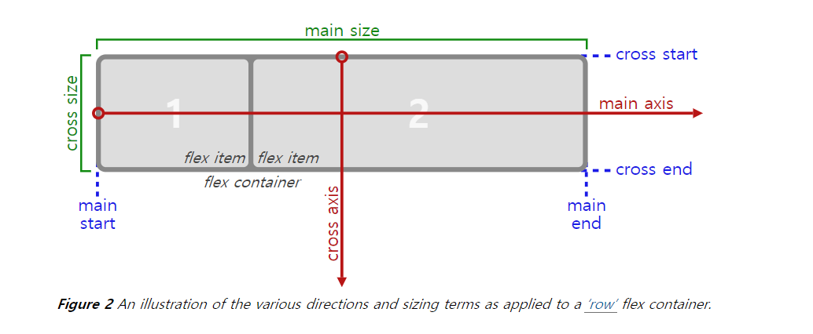
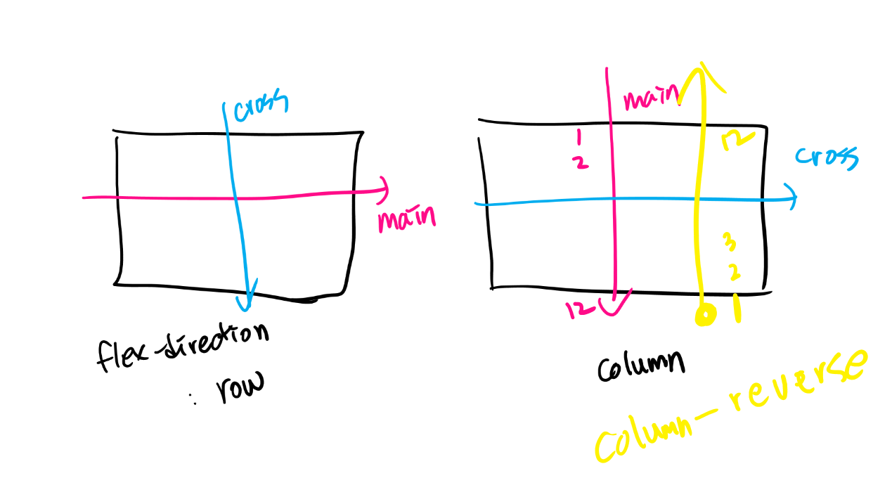

# flex

* `flex` 이전에는 배치를 위해서 `float` , `position` 지정을 해야 했다.
* https://www.w3.org/TR/css-flexbox-1/#box-model

## flex 주요 개념



* `container` , `item`

  ```html
  
    * 만약, `row-reverse` 로 지정하게 된다면, 오른쪽 끝부터 배치가 시작됨.
  * 모든 `item` 은 기본적으로 행으로 배치된다. (`flex-direction` : `row`  값으로 기본 설정 됨.)
  * 모든 `item` 은 `cross axis` 을 모두 채운다. (`align-items` : `stretch` 값으로 기본 설정 됨.)
  * 모든 `item` 은 본인의 너비 혹은 컨텐츠 영역만큼 너비를 가지게 된다.
    * 경우에 따라서, 본인이 지정받은 너비보다 작을 수 있다. (`flex-wrap: nowrap` 이 기본 값이기 때문)
      * 전체 아이템의 너비의 합이 컨테이너의 너비보다 작을 때

  

## flex 속성

### 1. flex-grow

> `flex-grow` 는 남은 너비를 비율로 나눠 가진다.

* 기본값 : `0`

### 2. justify-content

> main 축을 기준으로 정렬한다.

* 기본값 : `flex-start`
* flex-start
* flex-end
* center
* space-around
* space-between
* space-evenly

### 3. align-items

> cross 축을 기준으로 정렬한다.

* 기본값 : `stretch` 
* stretch
* flex-start
* flex-end
* baseline
* center

### 4. order

> 아이템의 순서를 정의할 수 있다.

* 기본값 : `0`
* 음수값도 가질 수 있음.

### 5. align-self

> 아이템에 직접 align을 지정할 수 있음.